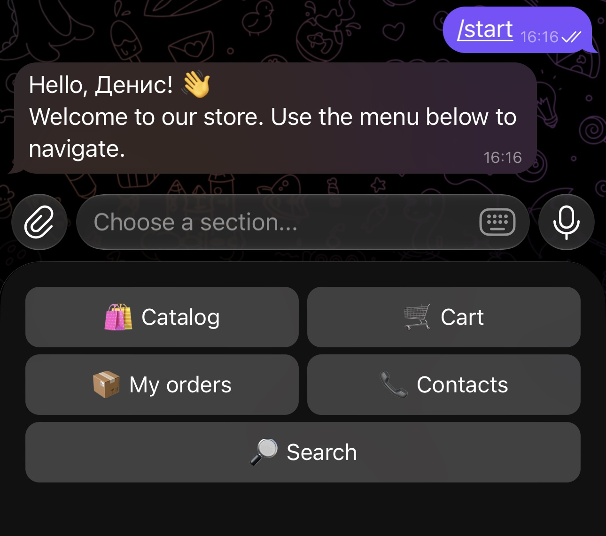
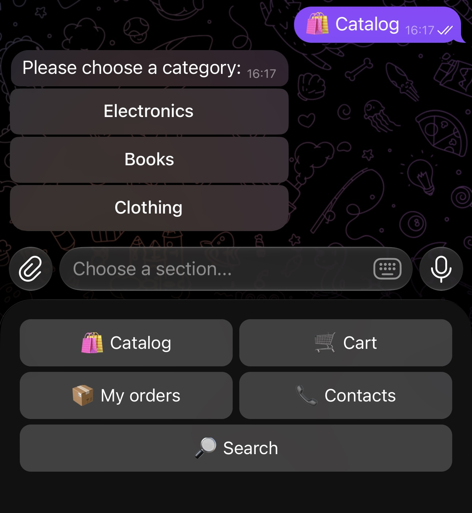
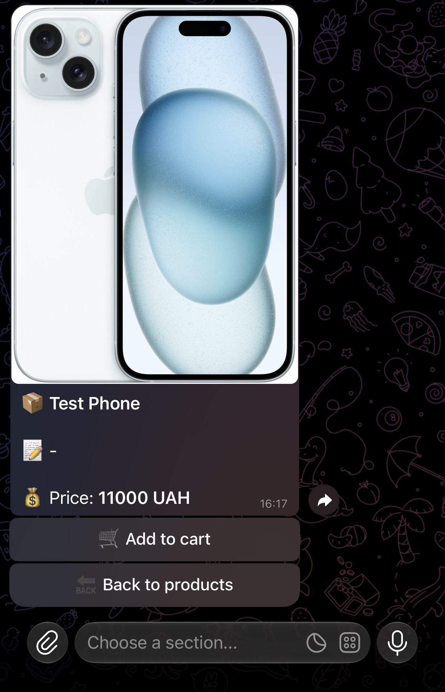
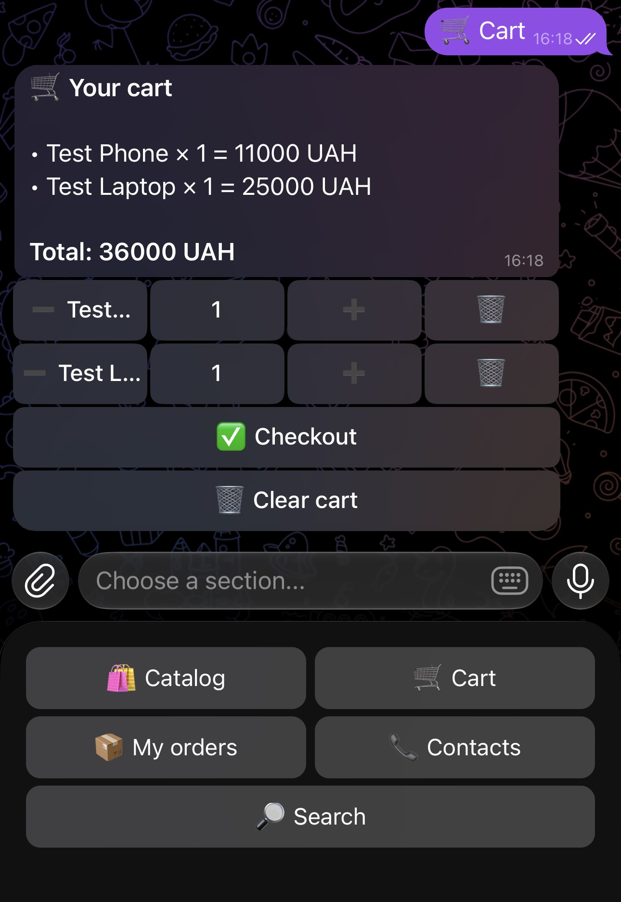
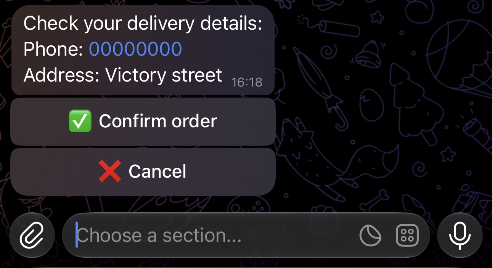
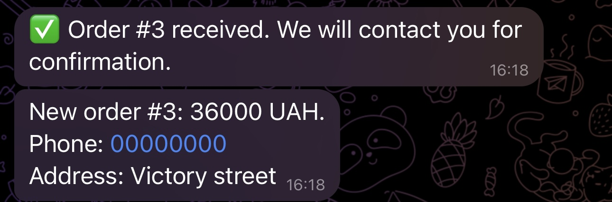

# Store Bot - QA Portfolio Project

This is a QA portfolio project based on a Telegram e-commerce bot.

The bot allows customers to browse products, manage a cart, place orders, and view their order history. It also includes an administrator panel for managing products, categories, orders, and backups.

I tested the project as a QA Engineer and focused on the flows that are most important for a small online store: browsing the catalog, adding products to the cart, checking out, and managing orders.

## Project Overview

**Application:** Store Bot  
**Platform:** Telegram  
**Environment:** Local  
**Database:** SQLite  
**Testing approach:** Manual functional testing with supporting automated database tests  
**Role:** QA Engineer  
**Test build:** v1.0-beta

## What I Tested

### Customer flow

- Starting the bot and using the main menu.
- Browsing product categories.
- Viewing product details.
- Searching for existing and missing products.
- Adding products to the cart.
- Increasing, decreasing, and removing product quantities.
- Checking cart totals.
- Validating phone numbers and delivery addresses.
- Cancelling checkout.
- Creating an order.
- Viewing order history and order details.
- Checking that users can access only their own orders.

### Admin flow

- Access control for the admin panel.
- Creating and editing products.
- Product price validation.
- Product photo handling.
- Viewing customer orders.
- Changing order statuses.
- Sending status updates to customers.
- Creating a database backup.

## Test Results

| Area | Result |
|---|---:|
| Smoke testing | 9 passed / 9 executed |
| Functional test cases | 23 passed / 23 executed |
| Negative test cases | 7 passed / 7 executed |
| Exploratory sessions | 2 completed |
| Automated database tests | 2 passed |
| Defects found | None in the tested scope |

The main customer flow and the administrator flow worked as expected in the local test environment.

## Evidence

### Start and Catalog

| Main menu | Catalog |
|---|---|
|  |  |

### Product and Cart

| Product details | Cart |
|---|---|
|  |  |

### Checkout and Order

| Checkout | Order created |
|---|---|
|  |  |

Additional evidence is available in the [evidence](evidence/) directory, including the admin panel and order status screenshots.

## QA Artifacts

- [Test Plan](Test-Plan.md)
- [Test Cases](Test-Cases.md)
- [Smoke Test Checklist](Checklist.md)
- [Exploratory Testing](Exploratory-Testing.md)
- [Regression Checklist](Regression-Checklist.md)
- [Database Verification](Database-Verification.md)
- [Test Design Techniques](Test-Design-Techniques.md)
- [Test Summary Report](Test-Summary-Report.md)

## Automated Tests

The project includes automated tests for database and order logic.

```bash
cd "Store Bot"
pytest -q
```

Result during testing:

```text
2 passed in 0.18s
```

## Scope and Limitations

The testing was performed in a local environment using Telegram Desktop. The following areas were outside the current scope:

- Online payment processing.
- Load and performance testing.
- Production deployment.
- Telegram platform availability.
- Security penetration testing.
- Separate testing on Telegram mobile clients.

## Test Environment

- macOS
- Python 3.13+
- aiogram 3
- SQLAlchemy 2
- SQLite
- Telegram Desktop

## Final Note

This project helped me practise the complete QA workflow: understanding the product, defining the scope, preparing test documentation, executing manual tests, checking database-related behavior, and summarizing the results.

The project passed the planned test scope with no defects found during execution.
